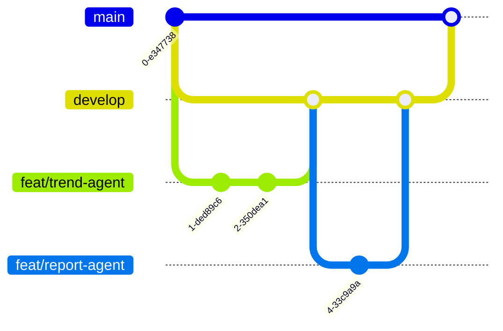

# 团队协作规范

## 一、分支策略

### 分支命名

| 分支类型 | 命名格式 | 示例 | 说明 |
|:---|:---|:---|:---|
| 主分支 | `main` | `main` | 生产就绪代码，保护分支，需 PR 审核 |
| 开发分支 | `develop` | `develop` | 日常集成分支，功能分支合并目标 |
| 功能分支 | `feat/<描述>` | `feat/trend-agent` | 新功能开发 |
| 修复分支 | `fix/<描述>` | `fix/evidence-schema` | Bug 修复 |
| 重构分支 | `refactor/<描述>` | `refactor/artifact-schema` | 代码重构 |
| 文档分支 | `docs/<描述>` | `docs/api-usage` | 文档更新 |
| 测试分支 | `test/<描述>` | `test/review-agent` | 测试补充 |

### 工作流



### 流程说明

1. **从 `develop` 创建功能分支**：`git checkout -b feat/<描述> develop`
2. **在功能分支上开发**：小步提交，见下方提交规范
3. **发起 Pull Request 到 `develop`**：至少 1 人 Review
4. **合并到 `develop`**：Squash Merge 保持历史整洁
5. **发布时从 `develop` 合并到 `main`**：使用 Merge Commit

> **禁止直接向 `main` 提交代码。** 所有变更必须经过 PR 审核。

---

## 二、提交规范

### Commit Message 格式

```
<type>(<scope>): <subject>

<body>
```

### type 类型

| 类型 | 说明 | 示例 |
|:---|:---|:---|
| `feat` | 新功能 | `feat(trend-agent): add TikTok data connector` |
| `fix` | 修复 | `fix(schema): fix EvidenceRef url validation` |
| `refactor` | 重构 | `refactor(analysis): extract base analyzer class` |
| `test` | 测试 | `test(review): add edge case for missing evidence` |
| `docs` | 文档 | `docs(api): add agent endpoint usage` |
| `chore` | 杂项 | `chore: update dependencies` |
| `style` | 格式 | `style: fix indentation` |

### 示例

```
feat(agents): add TrendAgent with TikTok data connector

- Implement TikTok trending hashtags crawler
- Add TrendHeatIndex calculation (3 dimensions)
- Write unit tests for data normalization
- Wire up to analysis pipeline via EvidenceRef

Closes #12
```

---

## 三、代码审查规范

### 审查要求

- **每个 PR 至少 1 人 Review** 后方可合并
- 组长（任星玥）对架构变更拥有最终决定权
- PR 标题格式：`[<type>] <简短描述>`

### 审查清单

| 维度 | 检查项 |
|:---|:---|
| 功能正确 | 逻辑是否正确？边界情况是否覆盖？ |
| 测试覆盖 | 新增代码是否有对应测试？测试是否通过？ |
| 代码风格 | 是否符合项目规范？命名是否清晰？ |
| 架构一致性 | 是否遵循四层架构设计？是否遵循 EvidenceRef 契约？ |
| 文档 | 是否需要更新 README 或 API 文档？ |

### Review 回复规范

- **LGTM**（Looks Good to Me）：通过
- **Comment**：建议性意见，不阻塞合并
- **Request Changes**：必须修改后才能合并

---

## 四、文件结构规范

```
SKU-Hunters/
├── .github/workflows/   # CI/CD 配置
├── docs/                 # 文档
│   ├── architecture/     # 架构设计文档
│   ├── api/              # API 文档
│   └── guides/           # 开发指南
├── backend/              # 后端服务
│   ├── app/
│   │   ├── agents/       # Agent 实现（每个 Agent 一个文件）
│   │   ├── schemas/      # Pydantic 数据模型
│   │   ├── engine/       # Decision Engine 核心
│   │   ├── data/         # 数据连接器
│   │   └── api/          # FastAPI 路由
│   └── tests/            # 测试
├── frontend/             # 前端仪表盘（可选）
├── data/                 # 样本数据与配置
├── scripts/              # 工具脚本
└── references/           # 参考资料
```

### 关键命名约定

| 规范 | 规则 |
|:---|:---|
| Python 文件 | 蛇形命名：`trend_agent.py` |
| 类名 | 大驼峰：`TrendAgent` |
| 函数/变量 | 蛇形：`calculate_heat_index()` |
| Schema 字段 | 蛇形：`evidence_refs` |
| API 路由 | 小写 + 连字符：`/api/v1/trends` |
| 测试文件 | `test_<模块名>.py`：`test_trend_agent.py` |

---

## 五、证据引用契约（EvidenceRef）

所有 Agent 的输出必须遵循统一的 EvidenceRef 格式：

```python
class EvidenceRef(BaseModel):
    url: str           # 信息来源链接
    title: str         # 信息标题
    snippet: str       # 关键摘要（<200字）
```

### 结构化产物类型

| 产物 | 文件 | 用途 |
|:---|:---|:---|
| `FeatureMatrix` | `feature.py` | 趋势分析矩阵 |
| `PricingComparison` | `pricing.py` | 定价对比表 |
| `UserSentiment` | `sentiment.py` | 用户情感分析 |
| `SWOTAnalysis` | `swot.py` | SWOT 分析 |
| `ReviewResult` | `review.py` | 审查结果 |

---

## 六、开发流程

### 日开发流程

```
1.  git pull origin develop       # 同步最新代码
2.  git checkout -b feat/xxx      # 创建功能分支
3.  开发 + 本地测试
4.  git add . && git commit -m "msg"  # 提交
5.  git push origin feat/xxx      # 推送
6.  创建 PR → 请求 Review
7.  合并到 develop
```

### 周同步节奏

| 时间 | 事项 |
|:---|:---|
| 周一 | 周计划同步会，确认本周 Sprint 目标 |
| 周三 | 中期进度检查，处理阻塞问题 |
| 周五 | 代码合并 + 周报提交 |

---

## 七、Issue 规范

### 标签体系

| 标签 | 说明 |
|:---|:---|
| `bug` | 功能缺陷 |
| `enhancement` | 功能增强 |
| `good first issue` | 适合新手的任务 |
| `help wanted` | 需要多人协作 |
| `priority: high` | 高优先级，需立即处理 |
| `priority: medium` | 中等优先级 |
| `priority: low` | 低优先级 |

### Issue 模板

```markdown
## 描述
[清晰描述问题或需求]

## 预期行为
[期望的结果]

## 实际行为
[当前的行为]

## 复现步骤（bug 类）
1. 
2. 
3. 

## 环境信息
- OS: 
- Python 版本: 
- 分支: