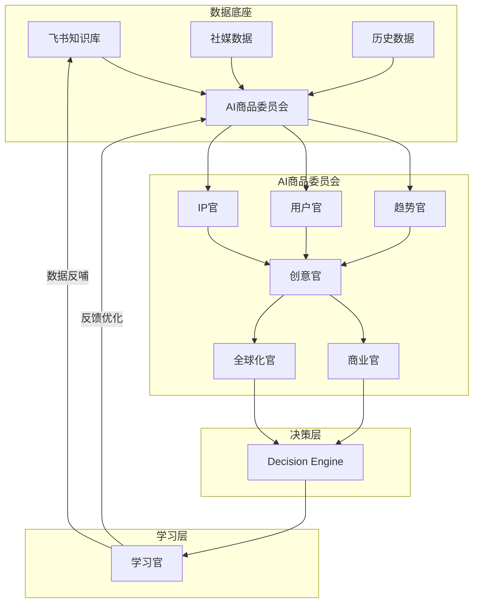

# 架构概览

## 四层架构

```
┌─────────────────────────────────────────────────┐
│             反馈学习层 · 学习官                    │
│        上市数据反哺 · 模型持续迭代                 │
└──────────────────────┬──────────────────────────┘
                       │
┌──────────────────────▼──────────────────────────┐
│             决策引擎层 · Decision Engine           │
│        综合多Agent意见 · 输出立项建议书             │
└──────────────────────┬──────────────────────────┘
                       │
┌──────────────────────▼──────────────────────────┐
│           AI 商品委员会 · 多Agent协同              │
│  ┌─────┐ ┌─────┐ ┌─────┐ ┌─────┐ ┌─────┐ ┌─────┐│
│  │趋势官│ │用户官│ │IP官 │ │创意官│ │商业官│ │全球 ││
│  └─────┘ └─────┘ └─────┘ └─────┘ └─────┘ └─────┘│
└──────────────────────┬──────────────────────────┘
                       │
┌──────────────────────▼──────────────────────────┐
│             数据底座层 · Data Foundation           │
│  飞书知识库 · 历史数据 · 社媒趋势 · 消费者洞察       │
└─────────────────────────────────────────────────┘
```

## 数据流



## Agent 协作模式

| 阶段 | 模式 | 参与 Agent | 协作逻辑 |
|:---|:---|:---|:---|
| 洞察汇聚 | 并行→汇聚 | 趋势官/用户官/IP官 | 三者独立分析，汇聚至创意官 |
| 方案生成 | 汇聚→发散 | 创意官 | 综合三方洞察，生成多个差异化方案 |
| 双轨评审 | 并行 | 商业官/全球化官 | 同步商业评估和全球化策略 |
| 综合决策 | 汇聚 | Decision Engine | 综合各方意见，输出立项建议书 |
| 持续学习 | 反馈闭环 | 学习官→全委员会 | 上市数据反哺，更新各Agent |

## 目录结构

```
backend/app/
├── agents/          # Agent 实现
│   ├── base_agent.py           # Agent 基类
│   ├── trend_agent.py          # 趋势官
│   ├── consumer_insight.py     # 用户官
│   ├── ip_strategy.py          # IP官
│   ├── product_ideation.py     # 创意官
│   ├── business_evaluation.py  # 商业官
│   ├── go_to_market.py         # 全球化官
│   └── learning_agent.py       # 学习官
├── schemas/         # 数据模型（EvidenceRef 契约）
│   ├── evidence.py             # 证据引用
│   ├── feature.py              # 趋势矩阵
│   ├── pricing.py              # 定价对比
│   ├── sentiment.py            # 用户情感
│   └── swot.py                 # SWOT分析
├── engine/          # 决策引擎
│   └── decision_engine.py      # 综合决策
├── data/            # 数据连接器
│   ├── feishu_connector.py     # 飞书数据接入
│   ├── social_connector.py     # 社媒数据接入
│   └── google_trends.py        # Google Trends
└── api/             # FastAPI 路由
    └── routes.py               # API 路由
```